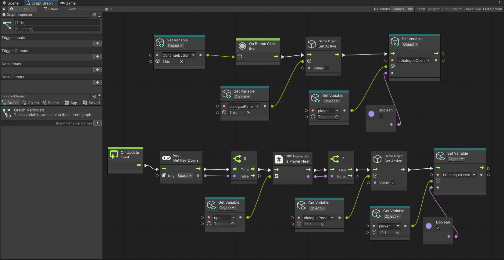

# GDIM33 Vertical Slice
## Milestone 1 Devlog

.jpg>)
1. For this assignment, I want to talk about the Visual Scripting graph that controls my NPC interaction. At first, I had a weird bug in my game: when the player pressed Space to open the dialogue box, they could still left-click with the mouse to move the ghost character away while talking. To fix this, I added a boolean variable called isDialogueOpen. Now, my graph uses an If node to check this boolean when the player presses the Space bar. If it is false, and the player is close enough to the NPC, the graph turns on the Dialogue UI and changes the boolean to true so the movement code knows to stop the player. After pressing the Continue button, the graph closes the UI and sets the boolean back to false, so the player can move normally again.
2. I updated my break-down and in my old diagram, the connection between the player and the dialogue UI was pretty simple. Now, the player logic is controlled by a State Graph with three main states: Start, Movement, and Dialogue. The game automatically goes from Start to Movement, which is where the player explores the map. When the player successfully interacts with an NPC, the state machine switches from Movement to Dialogue.
This state machine connects directly to my Dialogue UI system. Basically, entering the Dialogue state is what actually triggers the text canvas to show up on the screen. Because the player is now in the Dialogue state, my regular movement code stops working, which acts as a hard lock to prevent the movement bug I mentioned before. For example, if an NPC is giving the player a clue for a puzzle, the state machine makes sure the player has to read it and click a choice or the "Continue" button. Once they click the button, an event is sent back to the graph to hide the UI and transition the state machine back to Movement. This makes the game feel much smoother to control.

## Milestone 2 Devlog
Milestone 2 Devlog goes here.
## Milestone 3 Devlog
Milestone 3 Devlog goes here.
## Milestone 4 Devlog
Milestone 4 Devlog goes here.
## Final Devlog
Final Devlog goes here.
## Open-source assets

[Ghost character Free](https://assetstore.unity.com/packages/3d/characters/creatures/ghost-character-free-267003)
[Farm Assets](https://animagic3d.itch.io/farm-assets-1)

