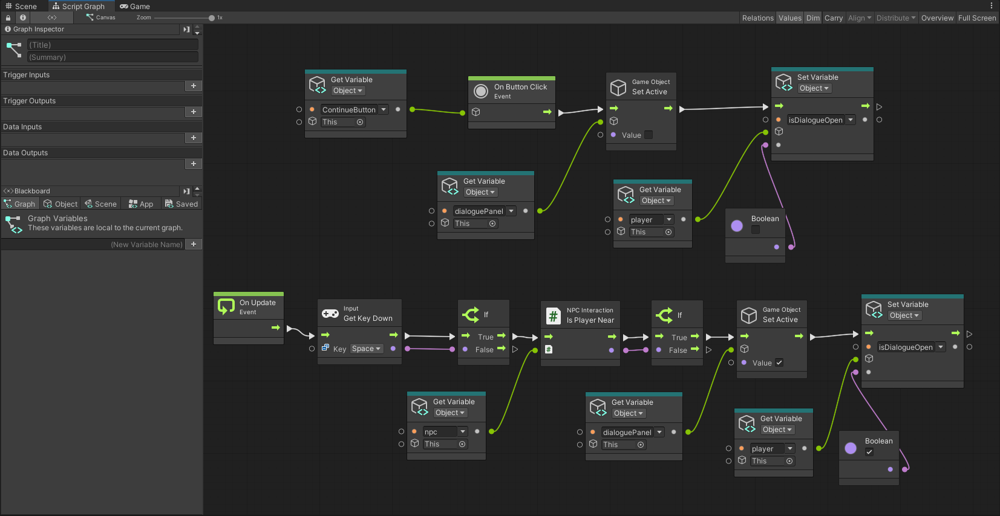

# GDIM33 Vertical Slice
## Milestone 1 Devlog

1.  I chose my canvas scripting graph, and I want to explain the Visual Scripting graph that controls my NPC interaction and the dialogue UI. The graph uses an On Update event to constantly listen for the player pressing the Space bar. When Space is pressed, the flow first goes into an If node to check a boolean variable called isDialogueOpen. I added this boolean because I found a bug during testing where the player could still click to move the ghost around while talking to the NPC. If the dialogue is not open (False), it then checks a custom Is Player Near node to see if the player is close enough to the NPC object. If both are true, it activates the Dialogue Panel game object and sets the isDialogueOpen variable to True. The top part of the graph handles closing the dialogue: when the player clicks the "ContinueButton", it triggers an On Button Click event, which deactivates the Dialogue Panel and sets isDialogueOpen back to False so the player can move normally again. Basically, it acts as a toggle switch that safely turns the conversation on and off without errors.

.jpg>)
2. Here is my new game breakdown, and in the previous version, the connection between the Player and the Dialogue UI was just a simple arrow. In the new update, I changed the "Player" node to show that it is entirely controlled by a State Graph with three main states: Start, Movement, and Dialogue. I also updated the Dialogue UI node to include the isDialogueOpen boolean variable, which acts as a bridge between the player's current state and the UI system.

Here is how the state machine works and how it relates to other systems in my game. The state machine basically acts as the main brain for the player. It starts and goes into the Movement state, which is where my point-and-click navigation system is active. When the player presses Space near an NPC, it triggers a transition that forces the state machine to exit Movement and enter the Dialogue state. This transition is directly related to two other major systems: the Movement System and the UI System. By putting the player in the Dialogue state, it completely shuts off the click-to-move scripts, so the character is frozen in place, fixing the movement bug. At the same time, it talks to the UI system to display the dialogue box and the Continue button.

## Milestone 2 Devlog
1. I decided to build a Cinematic Event System using Timeline to handle two cutscenes: finding the magic lamp and rubbing it to summon the genie, since I already have my inventory and basic movement set up. (Note: My W5 feature was Branching Dialogue, so this is a new one)

Step1: 
1. Make a second virtual camera just to get a close-up shot of the magic lamp.
2. Put a trigger zone by the river, so when the player walks into it, the camera switches over to the close-up.
3. Update my interaction script so that when the player picks up the lamp, it hides the object and drops it straight into the InventoryManager.

(Test: Run the game, walk up to the river, check if the camera swaps, and make sure the lamp actually goes into my inventory UI.)

Step 2:
1. Make two Playable Directors (Timelines). For the first one, just animate the lamp flying out of the lake and landing on the grass.
2. For the second one, record an Animation Track of the player ghost wiggling to look like it's rubbing the lamp.
3. Drop the smoke particle effect into a Control Track so it goes off right after the wiggle.
4. Add an Activation Track to turn on the Bull NPC right inside the smoke, and an Animation Track to make it scale up from 0 to 1 so it looks like it's popping out.

(Test: Hit play on the Timeline window and check if the timing of the smoke and the cow popping out looks good together.)

Step 3:
1. Hook up the inventory UI button (using Event Triggers for PointerUp/Down) so clicking the lamp triggers the second Timeline to play.
2. Write a C# script to grab the whole Timeline stage (the smoke and the cow objects) and teleport it exactly 2 units in front of the player, so the animation plays wherever I am on the map.
3. Add a quick NavMesh check in the script so if I'm facing the water, the cow spawns on the nearest valid grass instead of drowning in the lake.

(Test: Run the game, run right up against the lake, open the inventory, click the lamp, and check if the cow safely spawns on the ground facing me.)

2. Yes, it really helped. At first, I only had three big directions in my head, but writing this breakdown acted like a notebook that saved my logic before I got lost in the editor. I actually used my Test steps a lot during the process to make sure the current piece was working before moving to the next one. If I were to do it again, I would improve my breakdowns by writing down the exact variable names I plan to use right in the steps (like isGenieActive). That way, I wouldn't have to stop and think about naming things while coding, just like what we do in our lecture.

3. First, I built my player's NavMesh click-to-move using Visual Scripting. This graph perfectly bridges with my C# code because the very first thing it does is check an Object Variable (isDialogueOpen) controlled by my C# manager. If I am talking to the Genie, the graph uses a Negate node to instantly block the mouse input so I can't walk away. However, once the player was moving, I realized a static camera felt terrible. Doing smooth Lerp math is really messy in visual nodes, so I wrote a custom C# script (CameraFollow) to handle the smooth tracking in the background. Then, another issue came up: when I decorated the map with trees, the camera kept getting blocked by the leaves. To fix this, I wrote a second C# script (TreeHide). It constantly shoots a physics Raycast from the camera to the player. If the raycast hits a tree collider, the C# script temporarily fades out the tree's material so the player is always visible.

4. Please grade my Timeline system. I have two animations: one where the lamp flies to the shore when you walk right and go through a hitbox, and one where you rub the lamp to summon the Genie with smoke effects. (You can interact with the lamp by left-clicking on the lamp icon) 

## Milestone 3 Devlog

1. For this milestone, I made three shaders. The first one is for the magic lamp in the game. When the player puts the mouse on it, it will glow. The second shader is for the cow. Second, I made the genie blue and 
translucent; it is a real genie now. The third shader is an outline/highlight effect. I tried to make it similar to the outline effect of Prof. Reid's, but my model has a small bug. I've created a simple version that still shows the effect, and I will debug it or try another method.
2. I fixed a bug where the interaction prompt sometimes did not show up. Now the prompt appears more correctly when the player gets close to an object or NPC. Besides that, there are not many major bugs right now. Later, after I finish the last character art, I will also remove the white background from the character portraits and facial expressions, so they look more like normal visual novel character sprites.
3. Since the last milestone, I added a chicken NPC. The player now needs to interact with the chicken coop and talk to the chicken.  I also made a new Timeline animation for the chicken coop, an animation where the chicken comes out. I added a mechanism that, when the player finishes talking with the lamp, they can click on the lamp again to recall or summon the genie. Besides that, I made three shaders and wrote more dialogue/text for the game. 

## Final Devlog

### Question 1: 
My game is a 3D side-scrolling point-and-click adventure puzzle game where the player controls a ghost who discovers a magic lamp, embarking on a whimsical adventure. The core gameplay loop is about exploring the environment, collecting key items into an inventory, using those items to solve contextual puzzles, and engaging in branching dialogue to progress the narrative. In the current build, players can interact with various objects such as a magic lamp, a chicken coop, a gravestone, a treasure map, and a photo album. Key items like the lamp, map, and album are stored in the inventory for specific interactions. Furthermore, the game features a rich narrative delivery: dialogue choices are meaningful and yield unique responses, and major interactions trigger customized cinematic Timelines.

When relating this implemented content back to my original Vertical Slice plan, there has been a noticeable shift in design focus. Initially, I planned for the game to lean heavily into traditional, complex puzzle-solving mechanics. However, during development, the experience naturally evolved to be more narrative and dialogue-driven. Although the puzzle elements are lighter than originally intended, this Vertical Slice successfully achieves its primary goal. It encapsulates all the core gameplay systems, the intended emotional experience, and the fundamental game loop. By featuring a complete, playable sequence with a distinct beginning, middle, and end, this slice effectively illustrates to the player exactly what the pacing, tone, and mechanical flow of the full game will look like.

### Question 2:
In my game, I used Unity's Shader Graph to make three cool visual effects: a glowing look for the Genie Bull and magic lamp, and an outline effect for objects.

I wanted the Genie Bull to look like a magical spirit. To do this, I made a Genie_shader using a Fresnel Effect node. The Fresnel effect checks the angle between the camera's view direction and the model's surface normals, creating a bright ring around the edges of the 3D model. I then multiplied this ring with a custom Glowcolor and plugged it into the Emission channel. This makes the bull look like a glowing ghost. (I do the same thing to the magic lamp to make it glow.)

For the object outlines, I originally followed Professor Reid's tutorial. However, I ran into some issues where the outline wouldn't generate correctly on some parts of my specific models. So, I searched online and built a simpler version. Here is how I made it step by step: First, I took the Object Space Position of the mesh. Then, I took the model's Normal Vector and multiplied it by a custom Outline Thickness variable. A key step I added here was taking the model's Scale and dividing the thickness by it—this ensures the outline doesn't look weird when the object gets resized in the game. Finally, I added this pushed-out normal calculation back to the original position and plugged it into the Vertex Position. I then assigned a simple Outline Color to the Fragment shader. This creates a slightly larger, colored "shell" around the original object.

From a gameplay side, these rendering effects are controlled by my C# scripts. For the outline, I wrote a script called MouseHighlight (which you can find in the repo). The outline is not always on. When the player hovers their mouse over an interactable object, the MouseHighlight script detects it and dynamically activates the outline material on the object's MeshRenderer. When the mouse leaves, the script turns it off.

### Question 3:
My breakdown process is actually quite different from how most people do it. I think most people start by picking a game genre and then look at similar games to figure out what mechanics or characters they need. But my mind works differently. I usually start with a random image that pops into my head—like a funny scene, a story idea, or a specific ending.

For this game, I thought of the funny ending first, and then I built the whole game around it. I worked backward: I thought of a magic lamp, making a wish, why there is only one wish, and why the character would make such a funny wish. Once I have the story figured out, then I start breaking down what the game actually needs to make that story happen. I list it out like this: I need a magic lamp object -> the lamp needs an interaction script -> it needs an NPC inside -> the NPC needs a dialogue system -> the NPC gives tasks -> the player needs to interact with items to complete them and reach the ending. After I have this list, I finally break them down into the specific C# scripts and mechanics required.

1. For my planning process, I definitely plan to keep using the bubble diagrams and task step breakdowns we practiced this quarter. I have gotten very used to organizing my work into specific steps and pausing at milestones to test if things are actually working. You can even see this habit in my Git commits, where I often write down exactly what I just finished and what my next step will be.

2. Breaking a large project into small steps really helps me wrap my head around the overall scope and gives me a clear idea of the workload. However, I learned that breaking things down has its limits. In actual development, unexpected issues always pop up that you didn't plan for. For example, my outline shader didn't work at first because the model's mesh didn't have the proper structure, which took me a huge amount of extra time to fix. Also, my design ideas often change mid-project. Because of this, I realized that short-term step planning works perfectly for me, but making a super rigid long-term plan from day one simply doesn't work, because things are always changing.

3. This directly relates to how I created my Vertical Slice. As I mentioned earlier, I originally planned for a heavy puzzle game, but ended up reducing the puzzles. Even though the focus shifted, I still followed my step-by-step plan to get the core elements working, and overall, the process went smoothly.
  
   However, if I look at what went poorly and how I would improve, it would be my planning for small details. Late in development, I wanted to completely redo my dialogue UI. I realized I needed a name tag, a dialogue box, character portraits, a continue button, and option buttons. I wanted to make the portrait slightly transparent behind the dialogue box and let the player click anywhere on the screen to continue. But changing all these tiny details and interactions at the end was extremely messy and difficult, so I had to give up and stick to my old design.

   As a result, my big takeaway for next time is to heavily study reference games in the same genre before I break down my tasks. I need to figure out all the small details early on—like exactly what buttons are on the screen, or if the player clicks a specific button versus anywhere on the screen. Referencing other games early will help me build a much better and more detailed step-by-step plan from the very beginning.

## Open-source assets

[Ghost character Free](https://assetstore.unity.com/packages/3d/characters/creatures/ghost-character-free-267003)

[Farm Assets](https://animagic3d.itch.io/farm-assets-1)

[Fast Food Low Poly Building 3D](https://assetstore.unity.com/packages/3d/environments/urban/fast-food-low-poly-building-3d-180630)

[Environment Pack](https://assetstore.unity.com/packages/3d/vegetation/environment-pack-free-forest-sample-168396)

[Little Ghost lowpoly](https://assetstore.unity.com/packages/3d/characters/little-ghost-lowpoly-free-271926)

[Sound Effect (pixabay)](https://pixabay.com/)

[Sound Effect & BGM (aigei)](https://www.aigei.com/)
